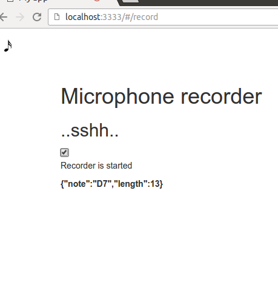
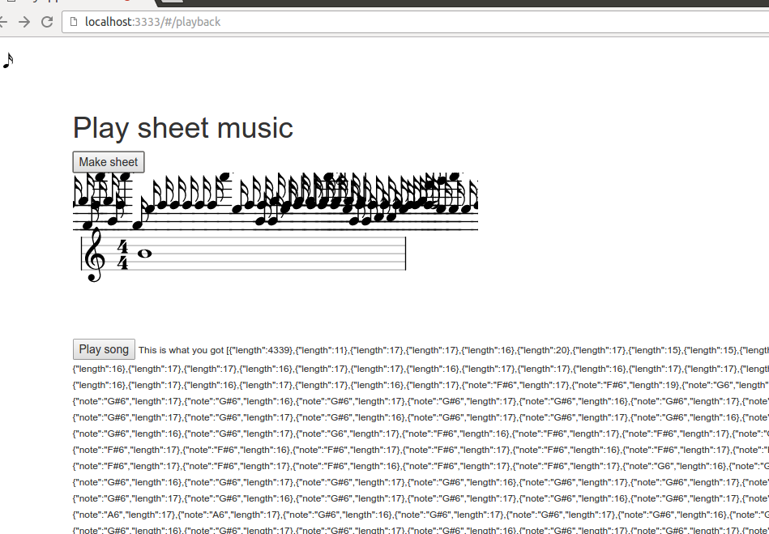

Music superhero tool (prototype) that converts sounds from the microphone (with WAD) into sheet music with Vexflow. There was supposed to be a node.js server with a mongodb database for saving the music but it isn't done yet. Wad and Vexflow are incredible software, but both are very bad at telling what is wrong with your input that makes them crash.

Note that this is just a toy for a tehcnology test! If you're serious about music you might try something like Intelliscore.

For installation instructions, see the base project this was forked from!
<b>For some reason, recording does not always work the first time the browser is started on Chromium(the logs show no permission to use the mic). This can be fixed by clicking the url of the browser tab and pressing enter to reload the page!</b>

Tuntikirjanpito <a href="tunnit.txt">täällä!</a>

